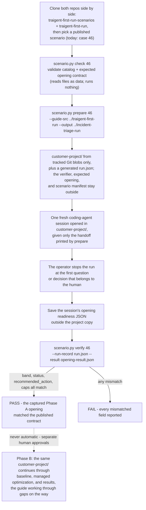

# Traigent First Run Scenarios

Public, reproducible simulated-project scenarios: realistic starting points
for the [Traigent Guided First Run](https://github.com/Traigent/traigent-first-run).
The published exercise today is the guide's context-isolated opening; the
route it opens continues, under human approvals, to baseline, managed
optimization, and results.

**How the pieces fit.** Three things carry the name Traigent here:

- [`Traigent/traigent-first-run`](https://github.com/Traigent/traigent-first-run) -
  the **guide**: the workflow a coding agent follows on a customer's own
  project, announced to the user as five stages (Inspect, Readiness, Baseline,
  Optimize, Results).
- **This repository** - simulated customer-shaped projects plus a CLI to check
  them, prepare a context-isolated copy, and compare supplied opening fields
  with a published contract at a pinned scenario revision.
- The **Traigent SDK and managed service** - the product the guide routes
  toward; licensed separately and not included here (see
  [Content origin and licensing](#content-origin-and-licensing)).

The subject of this repository is the whole bank of starting points, not one
case. Every scenario — published and planned — is a realistic starting state
that the guide takes toward the same finish line: baseline, managed
optimization, and results. Where the starting state has gaps, the guide's
route works through them on the way — create, repair, or review, with the
required human decisions, and honest disclosure of what cannot be closed —
and then continues; the pauses are where a human decides, not where the
journey ends. The one deliberate early end is an evaluator path
that would execute candidate code or SQL. Case 46 is simply the first
published starting point: the one that begins with no gaps to fill.

**Phase A** is the guide's opening: the coding agent inspects what exists,
explains the readiness state, and stops at the first question or decision that
belongs to the human. It needs no Traigent access code, project model-provider
credential, project-provider call, Traigent paid call, or optimization. The
approved coding-agent service may itself be remote or billed and receives the
project context supplied to it; that service is a separate customer boundary.
**Phase B** is the later human-approved live path (baseline, managed
optimization, results). Phase A never becomes Phase B automatically. Case `46`
in the commands below is a stable numeric alias for
`incident-severity-triage`, not a count of published scenarios.

The testing instructions call the human test operator the **captain**. This is
the person who prepares the isolated project, gives the coding agent its exact
handoff, enforces the stop point, and retains evidence; it is not a product
role.

The first published scenario is an optimization-ready incident-severity triage
project. It contains a synthetic agent, labeled rows, a deterministic evaluator,
and the public contract for the expected opening assessment. The repository does
not include a recorded worker run, so the current result is labeled **Scenario
contract · no recorded run**, not **Verified run evidence**.

At public guide revision
[`6ec2b9c1`](https://github.com/Traigent/traigent-first-run/tree/6ec2b9c161400cd91faea9c8cdb1c4e00d21c8d9),
the Guided First Run implements the route families summarized below: a ready
project advances to baseline approval; incomplete material is preserved,
created, repaired, or reviewed with the required human decisions; invalid
measurement stops before paid work; and, when inspection identifies an
evaluator path that would execute candidate code or SQL, this guide run ends
before that output executes. This repository tracks public, context-isolated
scenario coverage for those route families. One public test case is published
today. This is a governed path toward
optimization, not a promise that every project can optimize immediately or
earn an Excellent opening; the full claims model is in
[docs/methodology.md](docs/methodology.md).

## Scenarios in this repository

**Released today: one scenario — `incident-severity-triage` (case 46).** Six
more families are planned and listed further down; a family becomes a released
scenario only when its complete directory and validated manifest are checked
in here. A release is files you can read and pin to a Git revision — never a
recorded run or a measured outcome.

| Scenario                        | Starting condition            | Components                                                       | Expected route                                     | Evidence scope                                                                 |
| ------------------------------- | ----------------------------- | ---------------------------------------------------------------- | -------------------------------------------------- | ------------------------------------------------------------------------------ |
| `incident-severity-triage` (46) | All required components ready | Agent, dataset, and evaluator are present; four tunable settings | Proceed, because the required components are ready | Expected Phase A opening contract; no captured worker run or live optimization |

Its primary dataset is declared and checked as data rather than presentation
copy:

| Dataset            | Task                        | Shape                                                                                 | Splits                  | Difficulty                             | Important limits                                                                 |
| ------------------ | --------------------------- | ------------------------------------------------------------------------------------- | ----------------------- | -------------------------------------- | -------------------------------------------------------------------------------- |
| `incident-reports` | Closed-label classification | 120 unique inputs; 12 observed surface labels mapped to 4 normalized severity classes | 100 tuning / 20 holdout | 30 each: easy, medium, hard, very hard | Traigent-authored synthetic data; no customer data or observed model performance |

These facts come from the scenario's strict `scenario.json` catalog. `check`
compares its declared paths, row and unique-input counts, split and difficulty
counts, label coverage, normalized classes, and evaluator calibration count
with the materialized files. The presentation can render those facts, but it
does not own a second copy of them. Field-by-field meaning, with a sample row:
[reading the dataset](scenarios/incident-severity-triage/README.md#reading-datasetjsonl).

See [Scenario and dataset coverage](docs/scenario-coverage.md) for the current
public case, the explicitly not-yet-published coverage roadmap, dataset-origin
rules, and the claim supported by each test layer.

### Scenario families

The pinned public guide implements the route families summarized below. This
is a coverage model, not a claim that seven rows exhaust every project
condition. The rows are roadmap themes for public, context-isolated scenario
tests. A theme can require multiple cases or subcases when its conditions lead
to materially different actions; passing one case does not pass the theme. One
theme has a published reference case; the other six are planned coverage, not
test results.

| Family                 | Starting state the customer brings                                                                                                                 | What the Guided First Run does                                                                                                                                                     | Public case today                                                                      |
| ---------------------- | -------------------------------------------------------------------------------------------------------------------------------------------------- | ---------------------------------------------------------------------------------------------------------------------------------------------------------------------------------- | -------------------------------------------------------------------------------------- |
| Ready reference        | Agent, labeled data, evaluator, and four varying tunable settings are all present                                                                  | Explain the ready state and stop at the human's baseline approval                                                                                                                  | `incident-severity-triage` (case 46) - expected Phase A contract only; no captured run |
| Missing material       | Agent, dataset, expected outputs, or evaluator absent while other material remains usable                                                          | Preserve what exists; ask only for an unresolved human or domain choice; create or repair only a required dependency; otherwise disclose the limitation; re-check before paid work | Planned                                                                                |
| Dataset integrity      | Malformed or unknown row shape, missing labels, empty or overlapping splits, duplicates, or leakage                                                | Repair invalid comparison material; do not optimize against evidence that cannot support the claim                                                                                 | Planned                                                                                |
| Evidence strength      | Small, synthetic, undeclared, or mixed-provenance rows; model-generated answer key; small comparison sets or coarse outcome resolution             | Label a bounded demonstration honestly, request human review where required, and limit the claim                                                                                   | Planned                                                                                |
| Evaluator quality      | A present evaluator is unvalidated, opaque, inconsistent, invalid on known cases, or timing out                                                    | Calibrate it, inspect and repair or replace it, or pause for a bounded timeout decision; do not call a slow evaluator broken                                                       | Planned                                                                                |
| Execution safety       | Inspection identifies that the resolved evaluator path would execute candidate code or SQL, shell out with it, or submit it to an execution engine | End this guide run before candidate output executes; any containment and restart procedure is separate and human-governed                                                          | Planned                                                                                |
| Search-space readiness | The agent has no meaningful varying tunable settings, or declared settings are not wired into requests                                             | Establish and verify real variation before requesting approval for paid search                                                                                                     | Planned                                                                                |

In every family except execution safety, the actions above are waypoints, not
endings: once the gap is closed and the human approves, the run continues
along the same route toward baseline, optimization, and results. A family
defines where the opening pauses for a human, not how far the scenario can
go.

## Run a scenario against the guide

Five steps take a scenario from clone to a verified opening. Case `46` below
is today's published scenario; the same steps run any future one.

**1. Install** — clone both repositories side by side, in a disposable
directory outside any workspace a coding-agent session has already seen:

```bash
git clone https://github.com/Traigent/traigent-first-run-scenarios.git
git clone https://github.com/Traigent/traigent-first-run.git
cd traigent-first-run-scenarios
```

**2. Check** — validate the published scenario files (reads data only; runs
nothing, launches nothing):

```bash
python scenario.py list
python scenario.py check 46
```

**3. Isolate** — prepare a fresh, context-isolated copy of the scenario at a
new output path:

```bash
python scenario.py prepare 46 \
  --guide-src ../traigent-first-run \
  --output ../incident-triage-run
```

`prepare` copies only recorded Git blobs of the worker-visible project and
allowlisted guide files into `../incident-triage-run/customer-project/`, and
writes the captain-side identity and hashes to `../incident-triage-run/run.json`.
It runs no scenario code, no shell, no worker, and no network request.

**4. Run the guide** — open a **new** coding-agent session whose working
directory is `../incident-triage-run/customer-project/`, and give it only the
handoff `prepare` printed:

```text
Help me run my first Traigent optimization.
Use the Traigent first-run checkout at ./traigent-first-run and follow ./traigent-first-run/GUIDE.md.
```

The worker follows the guide's five stages on its own. Stop it at the first
question or decision that belongs to you, and save its machine-readable
opening readiness JSON outside the project copy. Do not mention this
repository, the case number, or the expected result — the worker behaves like
a real customer's coding agent only if it knows nothing else.

**5. Verify** — compare the captured opening with the published contract:

```bash
python scenario.py verify 46 \
  --run-record ../incident-triage-run/run.json \
  --result /path/to/opening-result.json
```

`verify` compares `band`, `status`, `recommended_action`, and `caps` against
the contract at the Git revision recorded in `run.json`, reading JSON as data
only. A `PASS` means those four fields matched — nothing more.

From there the route continues, not the exercise: with your approvals,
credentials, and cost boundaries in place, the same `customer-project/`
proceeds through baseline, managed optimization, and results, the guide
working through gaps on the way. No such continuation is recorded in this
repository. Full workflow detail: [GUIDE.md](GUIDE.md); before using a
customer-controlled machine, read
[the customer-PC runbook](docs/customer-pc-runbook.md).

### The reproduction flow at a glance

The whole arc is: **install** (clone both repositories), **isolate** (prepare a
fresh copy of one scenario outside any workspace an agent has seen), **run the
guide** (a blinded worker follows the Traigent Guided First Run inside that
copy), and **verify** (compare its opening against the published contract).
This flow is per-scenario, not specific to case 46: each published scenario is
prepared, run, and verified through these same steps — case 46 is simply the
one published today, and planned scenarios join the catalog the same way.
Every Phase A opening — case 46's included — ends at the first question that
belongs to a human; that is the exercise's boundary, not the route's. With the
separate approvals, credentials, and cost boundaries in place, the same
prepared `customer-project/` continues past the opening into baseline, managed
optimization, and results, the guide working through gaps on the way. No such
continuation is recorded here.



## Three distinct proof layers

| Layer                     | What happens                                                                          | What a pass means                                                                       |
| ------------------------- | ------------------------------------------------------------------------------------- | --------------------------------------------------------------------------------------- |
| Catalog check             | `list`, `show`, and `check` inspect public files                                      | The package and expected opening contract are structurally valid and fully materialized |
| Phase A opening           | A fresh worker receives only the prepared project and exact handoff                   | The captured opening fields match the declared scenario contract                        |
| Phase B live optimization | A human separately approves credentials, services, data movement, cost, and mutations | Only the explicitly approved live path was exercised                                    |

A catalog check is not an agent run. A Phase A match is not a live optimization
or end-to-end result. Phase B is never an automatic continuation of Phase A.

## Public scenario, context-isolated run

The scenario definition and verifier are public so customers can inspect and
reproduce the test. During a documented run, the captain gives the worker only
the prepared `customer-project/` and the handoff printed by `prepare`. The
scenario manifest, verifier, expected result, captain record, and previous
results remain outside the worker's supplied context.

This makes the run expected-result-blinded within the supplied context. The
worker receives the project's evaluator because it is part of the starting
state, but it does not receive the captain-side semantic verifier, expected
opening, or prior result. It is not a secret or adversarial benchmark, and it
is not operating-system containment.
A worker that deliberately searches the public repository or unrelated machine
files invalidates the run; this repository does not claim to prevent that
behavior.

## Repository map

```text
scenario.py                         Catalog, preparation, and verification CLI
scenarios/<slug>/scenario.json      Public scenario identity and content terms
scenarios/<slug>/project/           Files copied into the worker project
scenarios/<slug>/verifier/          Captain-side expected opening contract
schema/scenario.schema.json         Scenario manifest schema
docs/customer-pc-runbook.md         Customer-machine operating procedure
docs/methodology.md                 Claims, isolation, and evidence model
skills/traigent-first-run-scenarios Bundled agent skill for this repository
presentation/                       Shared browser and PowerPoint presentation
```

Each scenario is fully materialized. A run never assembles fragments from a
hidden shared dataset. This keeps each published starting point independently
reviewable, resettable, and reproducible.

## Customer presentation

[`presentation/`](presentation/README.md) renders one validated semantic story
as a self-contained HTML file and an editable PowerPoint with speaker notes.
Both formats use the same content and evidence labels. The current deck shows
which claims come from the pinned public guide and which come from the
published scenario contract; both are marked as having no recorded run. It
does not present a simulated result as a recorded run.

```bash
cd presentation
npm ci
npm run check
```

## Try Traigent on your own project

The public scenario workflow is for a reproducible demonstration. For a real
project, open your coding agent in that project and give it exactly:

```text
Help me run my first Traigent optimization.
Clone https://github.com/Traigent/traigent-first-run and follow GUIDE.md.
```

The guide asks the human to confirm decisions and approvals that should not be
made automatically.

## Content origin and licensing

`scenario.json` records the structured scenario catalog plus the origin and
license of the files published here.
That is distinct from a row-level `provenance` value inside the simulated
project. For example, `provenance: real` models what a fictional user declares
to the readiness scorer; it does not claim that the row came from a real
customer or third-party dataset.

Everything in this repository, including scenario data, documentation, and
supporting tools, is licensed under the [Apache License 2.0](LICENSE). See
[CONTRIBUTING.md](CONTRIBUTING.md) before proposing content and
[SECURITY.md](SECURITY.md) for private vulnerability reporting.

The `traigent` SDK is offered separately under
[AGPL-3.0-only](https://github.com/Traigent/Traigent/blob/main/LICENSE) or a
[Traigent commercial license](https://github.com/Traigent/Traigent/blob/main/COMMERCIAL-LICENSE.md)
under a separate written agreement. Nothing in this repository includes,
licenses, or grants rights to the SDK.
