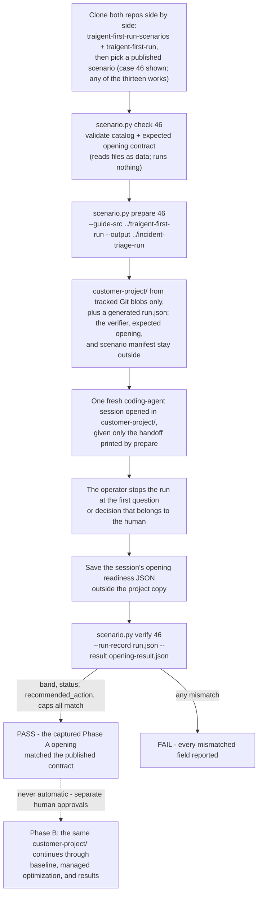

# Traigent First Run Scenarios

Public, reproducible simulated-project scenarios: realistic starting points
for the [Traigent Guided First Run](https://github.com/Traigent/traigent-first-run).
Today's exercise is the guide's context-isolated opening; the
route it opens continues, under human approvals, to baseline, managed
optimization, and results.

**How the pieces fit.** Three things carry the name Traigent here:

- [`Traigent/traigent-first-run`](https://github.com/Traigent/traigent-first-run) -
  the **guide**: the workflow a coding agent follows on a customer's own
  project, announced to the user as five stages (Inspect, Readiness, Baseline,
  Optimize, Results).
- **This repository** - simulated customer-shaped projects plus a CLI to check
  them, prepare a context-isolated copy, and compare supplied opening fields
  with a published contract at a pinned scenario revision.
- The **Traigent SDK and managed service** - the product the guide routes
  toward; licensed separately and not included here (see
  [Content origin and licensing](#content-origin-and-licensing)).

The subject of this repository is the whole bank of starting points, not one
case. Every scenario is a realistic starting state that the guide takes
toward the same finish line: baseline, managed optimization, and results.
Some starting states have gaps. The guide creates, repairs, or reviews what
it can, pauses for the human decisions that are required, discloses what
cannot be closed, and continues; a pause is where a human decides, not where
the journey ends. That holds for the execution-safety family too: where the
evaluator path would execute candidate code or SQL, the guide declines to
calibrate the customer's original evaluator, discloses the declined check on
the readiness card, and continues. Thirteen scenarios are published: three
declare every component ready, and ten declare a gap.

**Phase A** is the guide's opening: the coding agent inspects what exists,
explains the readiness state, and stops at the first question or decision that
belongs to the human. It needs no Traigent access code, project model-provider
credential, project-provider call, Traigent paid call, or optimization. The
approved coding-agent service may itself be remote or billed and receives the
project context supplied to it; that service is a separate customer boundary.
**Phase B** is the later human-approved live path (baseline, managed
optimization, results). Phase A never becomes Phase B automatically. Case
numbers such as `46` in the commands below are stable numeric aliases
(`legacy_id` in each `scenario.json`; `46` is `incident-severity-triage`),
not a count or an ordering of published scenarios.

The testing instructions call the human test operator the **captain**. This is
the person who prepares the isolated project, gives the coding agent its exact
handoff, enforces the stop point, and retains evidence; it is not a product
role.

Each published scenario is a customer-shaped project — an agent, rows, an
evaluator, or a declared absence of one of them — plus the public contract
for its expected opening assessment. Every expected opening in this bank was
measured by running the guide's own preflight, calibration, and readiness
scripts offline over the scenario's project bytes at the pinned guide
revision. That is a captain measurement of the guide's scripts over the
bytes, not a worker run. The repository includes no recorded worker run, so
every current result is labeled **Scenario contract · no recorded run**, not
**Verified run evidence**.

At public guide revision
[`d07b62cd`](https://github.com/Traigent/traigent-first-run/tree/d07b62cd4abb6ecb6d2edcdcb2d535f02bb2c199)
(readiness `schema_version` 6), the Guided First Run implements the route
families summarized below: a ready project advances to baseline approval;
incomplete material is preserved, created, repaired, or reviewed with the
required human decisions; invalid measurement stops before paid work; and,
when inspection identifies an evaluator path that would execute candidate
code or SQL, the guide declines to calibrate the customer's original
evaluator, records a containment warning, discloses the declined check on
the readiness card as `evaluator-calibration-refused`, and continues. This
repository tracks public, context-isolated scenario coverage for those route
families. Thirteen public scenarios are published today, at least one per
family. This is a governed path toward optimization, not a promise that
every project can optimize immediately or earn an Excellent opening; the
full claims model is in [docs/methodology.md](docs/methodology.md).

## Scenarios in this repository

**Released today: thirteen scenarios, cases 46 through 58.** Every family in
the coverage model further down has at least one released scenario. A
scenario is released only when its complete directory and validated manifest
are checked in here. A release is files you can read and pin to a Git
revision — never a recorded run or a measured outcome. ("Published" and
"released" mean the same thing here.)

The expected opening of every row is the four fields `verify` compares —
`band · status · recommended_action · caps` — as measured by the guide's own
scripts over the project bytes at guide revision `d07b62cd`. Each is a
case-specific contract for that scenario at that revision, not a target for
another project. The evidence scope of every row is the same: an expected
Phase A opening contract, with no captured worker run and no live
optimization.

| Scenario                             | Family                 | Starting state the project brings                                                                                                   | Expected opening (band · status · action · caps)                                                          |
| ------------------------------------ | ---------------------- | ----------------------------------------------------------------------------------------------------------------------------------- | --------------------------------------------------------------------------------------------------------- |
| `incident-severity-triage` (46)      | Ready reference        | Closed-label severity classifier; agent, labeled rows, evaluator, and four varying settings present                                 | EXCELLENT · OK · `proceed` · none                                                                         |
| `helpdesk-queue-router` (47)         | Ready reference        | Six-queue ticket router whose evaluator folds three ticketing tools' spellings together; all components ready                       | EXCELLENT · OK · `proceed` · none                                                                         |
| `policy-handbook-rag` (48)           | Ready reference        | Retrieval-augmented short-answer QA over a 20-document handbook; all components ready                                               | EXCELLENT · OK · `proceed` · none                                                                         |
| `warehouse-text-to-sql` (49)         | Evaluator quality      | Text-to-SQL over a shipped SQLite database; the scorer compares SQL as text, the wrong kind of check for the task                    | EXCELLENT · OK · `proceed` · none (the mismatch is a task-fit finding on the card, not a cap)              |
| `clinic-scheduling-sql-exec` (50)    | Execution safety       | Text-to-SQL whose scorer executes the generated query against the shipped database; calibration of the original is declined        | WORKABLE · OK · `confirm-evaluator-connection` · `evaluator-calibration-refused`                          |
| `booking-assistant-next-action` (51) | Dataset integrity      | Next-action selection from a flat chat transcript; six tuning transcripts repeat on the holdout side                                | PARTIAL · BLOCKED · `resplit-dataset` · `dataset-tune-holdout-overlap`, `dataset-repeated-rows`           |
| `tool-dispatch-selector` (52)        | Search-space readiness | Tool-call selection with one model, one fixed instruction, and no setting that varies                                               | PARTIAL · BLOCKED · `vary-knobs` · `agent-no-varying-knobs`                                               |
| `meeting-notes-summarizer` (53)      | Evaluator quality      | Free-text summarization whose evaluator delegates to a package that is not in the project; no calibration record                    | PARTIAL · BLOCKED · `repair-evaluator` · `evaluator-unresolved`                                           |
| `contract-clause-extractor` (54)     | Evidence strength      | Structured extraction with a set-F1 scorer; the answer key was drafted by a model and never reviewed                                | WORKABLE · OK · `review-answer-key` · `dataset-generated-answer-key`                                      |
| `returns-email-replies` (55)         | Missing material       | Reply drafting from 150 logged emails; no expected outputs, no evaluator, no calibration record                                     | PARTIAL · BLOCKED · `label-data` · `dataset-no-expected-outputs`, `evaluator-absent`                      |
| `freight-quote-estimator` (56)       | Evidence strength      | Numeric estimation with a tolerance scorer over 24 worked quotes                                                                    | STRONG · OK · `add-examples` · `dataset-coarse-resolution`                                                |
| `chatbot-on-vendor-flow` (57)        | Missing material       | Intent routing on a hosted vendor flow; labeled rows and a calibratable evaluator, but no local agent                               | NOT READY · BLOCKED · `connect-agent` · `agent-absent`                                                    |

Each scenario's primary dataset is declared and checked as data rather than
presentation copy:

| Scenario | Dataset | Task | Rows | Splits | Difficulty strata | Label shape |
| --- | --- | --- | --- | --- | --- | --- |
| 46 | `incident-reports` | Closed-label classification | 120 unique | 100 tuning / 20 holdout | 30 / 30 / 30 / 30 | 12 mapped label strings |
| 47 | `support-tickets` | Queue routing | 96 unique | 80 / 16 | 24 / 24 / 24 / 24 | 18 mapped label strings |
| 48 | `handbook-questions` | Short-answer QA | 90 unique | 75 / 15 | 23 / 23 / 22 / 22 | 69 unmapped label strings |
| 49 | `stock-questions` | Text-to-SQL | 80 unique | 66 / 14 | 20 / 20 / 20 / 20 | free text (SQL) |
| 50 | `scheduling-questions` | Text-to-SQL | 72 unique | 60 / 12 | 18 / 18 / 18 / 18 | free text (SQL) |
| 51 | `booking-chat-next-actions` | Closed-label classification | 100 rows, 94 unique | 83 / 17 | 25 / 25 / 25 / 25 | 8 mapped label strings |
| 52 | `voice-requests` | Tool-call selection | 90 unique | 75 / 15 | 23 / 23 / 22 / 22 | structured |
| 53 | `meeting-transcripts` | Free-text summarization | 40 unique | 34 / 6 | 10 / 10 / 10 / 10 | free text |
| 54 | `lease-clauses` | Structured extraction | 60 unique | 50 / 10 | 15 / 15 / 15 / 15 | structured |
| 55 | `inbound-returns-emails` | Free-text reply drafting | 150 unique | no split | no strata | absent |
| 56 | `worked-quotes` | Numeric estimation | 24 unique | 20 / 4 | 6 / 6 / 6 / 6 | numeric |
| 57 | `first-messages` | Intent routing | 90 unique | 75 / 15 | 23 / 23 / 22 / 22 | 6 mapped label strings |

Difficulty strata are listed as easy / medium / hard / very hard. Every
dataset is Traigent-authored synthetic content with no customer data and no
observed model performance; each scenario's `scenario.json` lists its own
further limitations.

These facts come from each scenario's strict `scenario.json` catalog.
`check` compares its declared paths, row and unique-input counts, split and
difficulty counts, label strings with their per-label row counts, and
evaluator calibration count with the materialized files. The presentation
can render those facts, but it does not own a second copy of them.

Every fact the catalog states is a fact about bytes that ship. `check` never
imports or executes a scenario file, so it does not establish what the shipped
evaluator does when it runs -- which spellings it scores alike, or what a
constant answer would score against it. The catalog therefore does not claim
it.

See [Scenario and dataset coverage](docs/scenario-coverage.md) for the
released scenarios by family, dataset-origin rules, and the claim supported by
each test layer.

### Scenario families

The pinned public guide implements the route families summarized below. This
is a coverage model, not a claim that seven rows exhaust every project
condition. The rows are themes for public, context-isolated scenario tests.
A theme can require multiple cases or subcases when its conditions lead to
materially different actions; a contract for one case is not a contract for
the theme. Every theme now has at least one released scenario; a released
scenario is an expected Phase A contract, not a test result.

| Family                 | Starting state the customer brings                                                                                                                 | What the Guided First Run does                                                                                                                                                                         | Released scenarios (expected Phase A contract only; no captured run)                |
| ---------------------- | -------------------------------------------------------------------------------------------------------------------------------------------------- | ------------------------------------------------------------------------------------------------------------------------------------------------------------------------------------------------------ | ----------------------------------------------------------------------------------- |
| Ready reference        | Agent, labeled data, evaluator, and varying tunable settings are all present                                                                       | Explain the ready state and stop at the human's baseline approval                                                                                                                                      | `incident-severity-triage` (46), `helpdesk-queue-router` (47), `policy-handbook-rag` (48) |
| Missing material       | Agent, dataset, expected outputs, or evaluator absent while other material remains usable                                                          | Preserve what exists; ask only for an unresolved human or domain choice; create or repair only a required dependency; otherwise disclose the limitation; re-check before paid work                     | `returns-email-replies` (55), `chatbot-on-vendor-flow` (57)                         |
| Dataset integrity      | Malformed or unknown row shape, missing labels, empty or overlapping splits, duplicates, or leakage                                                | Repair invalid comparison material; do not optimize against evidence that cannot support the claim                                                                                                     | `booking-assistant-next-action` (51)                                                |
| Evidence strength      | Small, synthetic, undeclared, or mixed-provenance rows; model-generated answer key; small comparison sets or coarse outcome resolution             | Label a bounded demonstration honestly, request human review where required, and limit the claim                                                                                                       | `contract-clause-extractor` (54), `freight-quote-estimator` (56)                    |
| Evaluator quality      | A present evaluator is unvalidated, opaque, inconsistent, invalid on known cases, timing out, or the wrong kind of check for the task              | Calibrate it, inspect and repair or replace it, or pause for a bounded timeout decision; do not call a slow evaluator broken                                                                           | `warehouse-text-to-sql` (49), `meeting-notes-summarizer` (53)                       |
| Execution safety       | Inspection identifies that the resolved evaluator path would execute candidate code or SQL, shell out with it, or submit it to an execution engine | Decline to calibrate the customer's original evaluator, record a containment warning, disclose the declined check on the card, and continue; a copied-actor route may calibrate a copy against a bounded target | `clinic-scheduling-sql-exec` (50)                                                   |
| Search-space readiness | The agent has no meaningful varying tunable settings, or declared settings are not wired into requests                                             | Establish and verify real variation before requesting approval for paid search                                                                                                                         | `tool-dispatch-selector` (52)                                                       |

In every family, the actions above are waypoints, not endings: once any gap
is closed and the human approves, the run continues along the same route
toward baseline, optimization, and results. A family defines where the
opening pauses for a human, not how far the scenario can go.

## Run a scenario against the guide

Five steps take a scenario from clone to a verified opening. This is the
minimal path; [GUIDE.md](GUIDE.md) is the complete, authoritative procedure.
Case `46` below is one of the thirteen published scenarios; the same steps run
any case `scenario.py list` shows, with an output path named after the
scenario you run.

**1. Install** — clone both repositories side by side, in a disposable
directory outside any workspace a coding-agent session has already seen:

```bash
git clone https://github.com/Traigent/traigent-first-run-scenarios.git
git clone https://github.com/Traigent/traigent-first-run.git
cd traigent-first-run-scenarios
```

**2. Check** — validate the scenario's files (reads data only; runs
nothing, launches nothing):

```bash
python scenario.py list
python scenario.py check 46
```

**3. Isolate** — prepare a fresh, context-isolated copy of the scenario at a
new output path whose parent already exists:

```bash
python scenario.py prepare 46 \
  --guide-src ../traigent-first-run \
  --output ../incident-triage-run
```

`prepare` copies only recorded Git blobs of the worker-visible project and
allowlisted guide files into `../incident-triage-run/customer-project/`, and
writes the captain-side identity, both checkout revisions, and content
hashes to `../incident-triage-run/run.json`. It requires both checkouts clean
at their recorded `HEAD` and fails loudly otherwise. It invokes local Git
read-only; it runs no scenario code, shell, worker, or network request.

**4. Run the guide** — open a **new** coding-agent session whose working
directory is `../incident-triage-run/customer-project/`, and give it only the
handoff `prepare` printed:

```text
Help me run my first Traigent optimization.
Use the Traigent first-run checkout at ./traigent-first-run and follow ./traigent-first-run/GUIDE.md.
```

Paste the handoff your own `prepare` printed — `run.json` records that exact
text as evidence; the block above only shows what it looks like.

The worker begins the guide's route on its own. Stop it at the first
question or decision that belongs to you, and save its machine-readable
opening readiness JSON outside the project copy. Do not mention this
repository, the case number, or the expected result — the worker behaves like
a real customer's coding agent only if it knows nothing else.

**5. Verify** — compare the captured opening with the published contract:

```bash
python scenario.py verify 46 \
  --run-record ../incident-triage-run/run.json \
  --result /path/to/opening-result.json
```

`verify` compares `band`, `status`, `recommended_action`, and `caps` against
the contract loaded via local Git at the revision recorded in `run.json`,
reading the result as data. A `PASS` means the four fields matched the
contract at that recorded revision — nothing more; [GUIDE.md](GUIDE.md)
states the exact claim boundary.

From there the route continues, not the exercise: with your approvals,
credentials, and cost boundaries in place, the same `customer-project/`
proceeds through baseline, managed optimization, and results. No such
continuation is recorded in this repository. Full workflow detail: [GUIDE.md](GUIDE.md); before using a
customer-controlled machine, read
[the customer-PC runbook](docs/customer-pc-runbook.md).

### The reproduction flow at a glance

The whole arc is: **install** (clone both repositories), **check** (validate
the scenario package), **isolate** (prepare a
fresh copy of the chosen scenario outside any workspace an agent has seen),
**run the guide** (a blinded worker follows the Traigent Guided First Run inside that
copy), and **verify** (compare its opening against the published contract).
This flow is per-scenario, not specific to case 46: each of the thirteen
published scenarios is prepared, run, and verified through these same steps,
and a later scenario joins the catalog the same way. Every Phase A opening —
whether the contract reads `proceed` or `BLOCKED` — ends at the first
question that belongs to a human; that is the exercise's boundary, not the
route's.



## Three distinct proof layers

| Layer                     | What happens                                                                          | What a pass means                                                                       |
| ------------------------- | ------------------------------------------------------------------------------------- | --------------------------------------------------------------------------------------- |
| Catalog check             | `list`, `show`, and `check` inspect public files                                      | The package and expected opening contract are structurally valid and fully materialized |
| Phase A opening           | A fresh worker receives only the prepared project and exact handoff                   | The captured opening fields match the declared scenario contract                        |
| Phase B live optimization | A human separately approves credentials, services, data movement, cost, and mutations | Only the explicitly approved live path was exercised                                    |

A catalog check is not an agent run. A Phase A match is not a live optimization
or end-to-end result. Phase B is never an automatic continuation of Phase A.

## Public scenario, context-isolated run

The scenario definition and verifier are public so customers can inspect and
reproduce the test. During a documented run, the captain gives the worker only
the prepared `customer-project/` and the handoff printed by `prepare`. The
scenario manifest, verifier, expected result, captain record, and previous
results remain outside the worker's supplied context.

This makes the run expected-result-blinded within the supplied context. The
worker receives the project's evaluator because it is part of the starting
state, but it does not receive the captain-side semantic verifier, expected
opening, or prior result. It is not a secret or adversarial benchmark, and it
is not operating-system containment.
A worker that deliberately searches the public repository or unrelated machine
files invalidates the run; this repository does not claim to prevent that
behavior.

## Repository map

```text
scenario.py                         Catalog, preparation, and verification CLI
scenarios/<slug>/README.md          The scenario's starting state, in prose
scenarios/<slug>/scenario.json      Public scenario identity, catalog, and content terms
scenarios/<slug>/project/           Files copied into the worker project
scenarios/<slug>/verifier/          Captain-side expected opening contract
schema/scenario.schema.json         Scenario manifest schema
scripts/check_public_surface.py     Public-surface guard over tracked bytes and paths
docs/scenario-coverage.md           Released scenarios by family and dataset-origin rules
docs/customer-pc-runbook.md         Customer-machine operating procedure
docs/methodology.md                 Claims, isolation, and evidence model
skills/traigent-first-run-scenarios Bundled agent skill for this repository
presentation/                       Shared browser and PowerPoint presentation
```

Thirteen scenario directories are checked in, `incident-severity-triage`
through `regex-rule-authoring`. Each is fully materialized. A run never
assembles fragments from a hidden shared dataset. This keeps each published
starting point independently reviewable, resettable, and reproducible.

## Customer presentation

[`presentation/`](presentation/README.md) renders one validated semantic story
as a self-contained HTML file and an editable PowerPoint with speaker notes.
Both formats use the same content and evidence labels. The current deck shows
which claims come from the pinned public guide and which come from the
published scenario contract; both are marked as having no recorded run. It
does not present a simulated result as a recorded run.

```bash
cd presentation
npm ci
npm run check
```

## Try Traigent on your own project

The public scenario workflow is for a reproducible demonstration. For a real
project, open your coding agent in that project and give it exactly:

```text
Help me run my first Traigent optimization.
Clone https://github.com/Traigent/traigent-first-run and follow GUIDE.md.
```

The guide asks the human to confirm decisions and approvals that should not be
made automatically.

## Content origin and licensing

Each scenario's `scenario.json` records its structured catalog plus the
origin and license of the files published here. All thirteen scenarios are
Traigent-authored synthetic content: every company, person, database row,
handbook page, transcript, and email in them is invented for the scenario.
That is distinct from a row-level `provenance` value inside the simulated
project. For example, `provenance: real` models what a fictional user declares
to the readiness scorer; it does not claim that the row came from a real
customer or third-party dataset.

Everything in this repository, including scenario data, documentation, and
supporting tools, is licensed under the [Apache License 2.0](LICENSE). See
[CONTRIBUTING.md](CONTRIBUTING.md) before proposing content and
[SECURITY.md](SECURITY.md) for private vulnerability reporting.

The `traigent` SDK is offered separately under
[AGPL-3.0-only](https://github.com/Traigent/Traigent/blob/main/LICENSE) or a
[Traigent commercial license](https://github.com/Traigent/Traigent/blob/main/COMMERCIAL-LICENSE.md)
under a separate written agreement. Nothing in this repository includes,
licenses, or grants rights to the SDK.
